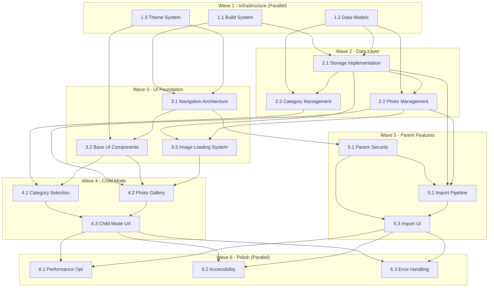

# SmilePile Dependency Graph - Parallel Execution Plan

## Execution Waves Overview



## Parallel Execution Strategy

### Wave 1: Foundation (Day 1)
**Parallel Capacity**: 3 agents
**Duration**: 4-6 hours

| Task | Agent Type | Duration | Can Parallel |
|------|------------|----------|--------------|
| 1.1 Build System | Backend Developer | 2h | ✅ Yes |
| 1.2 Data Models | Backend Developer | 2h | ✅ Yes |
| 1.3 Theme System | UI Developer | 3h | ✅ Yes |

**Execution Command**:
```bash
python parallel_orchestrator.py execute SMILE-001 \
  --wave 1 \
  --tasks "1.1,1.2,1.3" \
  --max-agents 3
```

### Wave 2: Data Layer (Day 1-2)
**Parallel Capacity**: 2 agents after 2.1
**Duration**: 6-8 hours

| Task | Agent Type | Duration | Dependencies | Can Parallel |
|------|------------|----------|--------------|--------------|
| 2.1 Storage | Backend Developer | 3h | 1.1, 1.2 | ❌ Must run first |
| 2.2 Photo Mgmt | Backend Developer | 3h | 1.2, 2.1 | ✅ With 2.3 |
| 2.3 Category Mgmt | Backend Developer | 2h | 1.2, 2.1 | ✅ With 2.2 |

**Execution Command**:
```bash
# First run 2.1 alone
python parallel_orchestrator.py execute SMILE-001 --task 2.1

# Then run 2.2 and 2.3 in parallel
python parallel_orchestrator.py execute SMILE-001 \
  --tasks "2.2,2.3" \
  --max-agents 2
```

### Wave 3: UI Foundation (Day 2)
**Parallel Capacity**: 2 agents
**Duration**: 5-7 hours

| Task | Agent Type | Duration | Dependencies | Can Parallel |
|------|------------|----------|--------------|--------------|
| 3.1 Navigation | UI Developer | 2h | 1.1, 1.3 | ✅ With 3.3 |
| 3.2 Base UI | UI Developer | 3h | 1.3, 3.1 | ❌ After 3.1 |
| 3.3 Image Loading | Performance Rev | 3h | 2.1, 2.2 | ✅ With 3.1 |

**Execution Command**:
```bash
# Run 3.1 and 3.3 in parallel
python parallel_orchestrator.py execute SMILE-001 \
  --tasks "3.1,3.3" \
  --max-agents 2

# Then run 3.2
python parallel_orchestrator.py execute SMILE-001 --task 3.2
```

### Wave 4: Child Mode (Day 2-3)
**Parallel Capacity**: 2 agents initially
**Duration**: 6-8 hours

| Task | Agent Type | Duration | Dependencies | Can Parallel |
|------|------------|----------|--------------|--------------|
| 4.1 Category Screen | UI Developer | 3h | 2.3, 3.2 | ✅ With 4.2 |
| 4.2 Photo Gallery | UI Developer | 4h | 2.2, 3.2, 3.3 | ✅ With 4.1 |
| 4.3 Child UX | UI Developer | 2h | 4.1, 4.2 | ❌ After both |

**Execution Command**:
```bash
# Run 4.1 and 4.2 in parallel
python parallel_orchestrator.py execute SMILE-001 \
  --tasks "4.1,4.2" \
  --max-agents 2

# Then run 4.3
python parallel_orchestrator.py execute SMILE-001 --task 4.3
```

### Wave 5: Parent Features (Day 3)
**Parallel Capacity**: 1 agent (sequential)
**Duration**: 5-6 hours

| Task | Agent Type | Duration | Dependencies | Can Parallel |
|------|------------|----------|--------------|--------------|
| 5.1 Parent Security | Security Reviewer | 2h | 3.1 | ❌ Sequential |
| 5.2 Import Pipeline | Backend Developer | 2h | 2.1, 2.2, 5.1 | ❌ Sequential |
| 5.3 Import UI | UI Developer | 2h | 5.1, 5.2 | ❌ Sequential |

**Execution Command**:
```bash
# Run sequentially
python parallel_orchestrator.py execute SMILE-001 \
  --tasks "5.1,5.2,5.3" \
  --sequential
```

### Wave 6: Polish & Optimization (Day 4)
**Parallel Capacity**: 3 agents
**Duration**: 4-5 hours

| Task | Agent Type | Duration | Dependencies | Can Parallel |
|------|------------|----------|--------------|--------------|
| 6.1 Performance | Performance Rev | 3h | All previous | ✅ Yes |
| 6.2 Accessibility | UI Developer | 2h | 4.*, 5.3 | ✅ Yes |
| 6.3 Error Handling | Backend Developer | 2h | All previous | ✅ Yes |

**Execution Command**:
```bash
python parallel_orchestrator.py execute SMILE-001 \
  --tasks "6.1,6.2,6.3" \
  --max-agents 3
```

## Critical Path Analysis

### Longest Dependency Chain
```
1.2 Data Models (2h)
  → 2.1 Storage (3h)
  → 2.2 Photo Management (3h)
  → 3.3 Image Loading (3h)
  → 4.2 Photo Gallery (4h)
  → 4.3 Child UX (2h)
  → 6.1 Performance Optimization (3h)

Total Critical Path: 20 hours
```

### Parallelization Savings

| Execution Type | Total Duration | Agent Hours |
|----------------|----------------|-------------|
| Sequential | 40 hours | 40 hours |
| Parallel (Optimized) | 20 hours | 40 hours |
| **Time Saved** | **20 hours (50%)** | - |

## Resource Allocation

### Agent Distribution

| Agent Type | Tasks Assigned | Total Hours | Utilization |
|------------|---------------|-------------|-------------|
| Backend Developer | 8 tasks | 17h | 42.5% |
| UI Developer | 8 tasks | 17h | 42.5% |
| Performance Reviewer | 2 tasks | 6h | 15% |
| Security Reviewer | 1 task | 2h | 5% |

### Optimal Agent Pool
- **Minimum**: 2 concurrent agents
- **Recommended**: 3 concurrent agents
- **Maximum Benefit**: 3 concurrent agents (no additional speedup beyond 3)

## Dependency Validation Rules

### Pre-Execution Checks
```python
def validate_dependencies(task_id):
    dependencies = {
        "2.1": ["1.1", "1.2"],
        "2.2": ["1.2", "2.1"],
        "2.3": ["1.2", "2.1"],
        "3.1": ["1.1", "1.3"],
        "3.2": ["1.3", "3.1"],
        "3.3": ["2.1", "2.2"],
        "4.1": ["2.3", "3.2"],
        "4.2": ["2.2", "3.2", "3.3"],
        "4.3": ["4.1", "4.2"],
        "5.1": ["3.1"],
        "5.2": ["2.1", "2.2", "5.1"],
        "5.3": ["5.1", "5.2"],
        "6.1": ["4.3", "5.3"],
        "6.2": ["4.3", "5.3"],
        "6.3": ["4.3", "5.3"]
    }

    for dep in dependencies.get(task_id, []):
        if not is_task_complete(dep):
            return False, f"Dependency {dep} not complete"
    return True, "All dependencies satisfied"
```

## Conflict Resolution

### Resource Conflicts
- **Database Schema**: Tasks 2.1, 2.2, 2.3 must coordinate on schema
- **Theme Resources**: Tasks 1.3, 3.2, 4.1 must use consistent theme definitions
- **Navigation Graph**: Tasks 3.1, 4.3, 5.1 must align on navigation structure

### File Conflicts
```yaml
Potential Conflicts:
  - app/build.gradle: [1.1, 2.1, 3.1]
  - database/schema: [2.1, 2.2, 2.3]
  - res/values/themes.xml: [1.3, 3.2, 6.2]
  - navigation/nav_graph.xml: [3.1, 4.3, 5.1]

Resolution Strategy:
  - Use Git branches for parallel work
  - Automated merge for non-conflicting changes
  - Manual review for overlapping modifications
  - Lock files during critical updates
```

## Execution Monitoring

### Progress Tracking
```bash
# Check overall progress
python atlas.py status SMILE-001

# Check specific wave status
python parallel_orchestrator.py status SMILE-001 --wave 3

# View dependency graph
python dependency_graph.py visualize SMILE-001

# Check critical path
python dependency_graph.py critical-path SMILE-001
```

### Performance Metrics
- **Wave Completion Time**: Track actual vs estimated
- **Agent Utilization**: Monitor idle time
- **Dependency Wait Time**: Identify bottlenecks
- **Parallel Efficiency**: Measure speedup factor

## Rollback Strategy

### Wave-Level Rollback
```bash
# Rollback specific wave
python atlas.py rollback SMILE-001 --wave 4

# Rollback with dependency cascade
python atlas.py rollback SMILE-001 --wave 3 --cascade
```

### Task-Level Recovery
- Each task maintains checkpoint state
- Failed tasks can resume from last checkpoint
- Parallel siblings continue independently
- Dependencies blocked until resolution

## Success Criteria

### Execution Benchmarks
- **Total Duration**: < 24 hours with 3 agents
- **Parallel Efficiency**: > 80% agent utilization
- **Dependency Violations**: 0 conflicts
- **Rollback Events**: < 2 per workflow
- **First-Pass Success**: > 90% of tasks