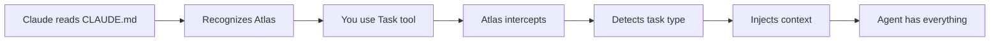

# Atlas Framework Setup Instructions

## Quick Setup (2 Minutes)

### 1. Copy Atlas to Your Project
```bash
# From your project root
cp -r /path/to/atlas ./atlas
```

### 2. Update CLAUDE.md
```bash
# Create or prepend CLAUDE.md with Atlas preamble
cat atlas/01_CORE/CLAUDE_MD_PREAMBLE.md > CLAUDE.md.new
[ -f CLAUDE.md ] && cat CLAUDE.md >> CLAUDE.md.new
mv CLAUDE.md.new CLAUDE.md
```

### 3. Validate Installation
```bash
python3 atlas/test_context_injection.py
```

You should see:
```
🎉 ALL TESTS PASSED! The system works as expected!
```

## What Gets Installed

```
your-project/
├── CLAUDE.md                    # ← Updated with Atlas awareness
├── atlas/                       # ← Atlas Framework
│   ├── 01_CORE/                #   Core standards & prompts
│   ├── 02_WORKFLOWS/            #   Development workflows
│   ├── 03_AGENTS/               #   Agent specifications
│   ├── 06_CHECKLISTS/           #   Verification checklists
│   ├── 07_AUTOMATION/           #   Context injection system
│   ├── 09_STORIES/              #   Your project stories
│   └── config/                  #   Context configuration
└── [your existing files]
```

## How It Works

### Automatic Context Flow



### No Manual Steps Required

**Without Atlas:**
```python
# You had to do this:
"Read files: workflow.md, standards.md, templates.md..."
"Now create a story for..."
# Often failed due to missing context
```

**With Atlas:**
```python
# Just do this:
Task("Create auth story", details, "story-writer")
# Context automatically injected! ✨
# Includes verification checklists! ✅
```

### New: Automatic Verification Checklists

Each context profile now includes tailored checklists to ensure quality:
- **Story Creation**: 9 required checks for proper story format
- **Bug Fixing**: Root cause analysis and regression test checks
- **UI Development**: Accessibility and responsive design checks
- **Backend**: API design and security checks
- **Testing**: Coverage and edge case checks

Checklists are automatically included with minimal overhead (< 0.1ms).

## First Task After Setup

Try this to confirm everything works:

```
Create a user story for adding a search feature to the homepage.
Users should be able to search for products by name, category, or SKU.
```

Claude should:
1. Recognize Atlas is installed (from CLAUDE.md)
2. Use the story creation workflow
3. Automatically get story templates and standards
4. Create a properly formatted Atlas story

## Customization Options

### Add Project-Specific Context

Edit `atlas/config/context_manifest.json`:
```json
{
  "context_profiles": {
    "ui_development": {
      "files": {
        "project": [
          {
            "path": "src/components/README.md",
            "priority": 1
          }
        ]
      }
    }
  }
}
```

### Add Custom Agent Types

Edit `atlas/config/agent_context_mapping.yaml`:
```yaml
agent_types:
  my-specialist:
    default_profile: "backend_development"
    description: "Custom specialist for my domain"
```

### Add Project Documentation

Create project-specific docs that get auto-included:
```bash
mkdir -p atlas/01_CORE/project
echo "# Project Architecture" > atlas/01_CORE/project/ARCHITECTURE.md
```

## Verification Checklist

After setup, verify:

- [ ] `atlas/` directory exists in project root
- [ ] CLAUDE.md starts with Atlas preamble
- [ ] `python3 atlas/test_context_injection.py` passes
- [ ] `ls atlas/09_STORIES/` shows features/bugs directories
- [ ] First task spawns with auto-context

## Troubleshooting

### "Module not found" Error
```bash
# Install required dependencies
pip3 install pyyaml
```

### "Context not injecting"
```bash
# Run validation
python3 atlas/07_AUTOMATION/task_context_integration.py validate
```

### "Files not found in manifest"
Normal for missing optional files. System uses fallbacks.

## Quick Commands

```bash
# Validate system
python3 atlas/07_AUTOMATION/task_context_integration.py validate

# List available context profiles
python3 atlas/07_AUTOMATION/enhanced_context_injector.py list

# Test specific context injection
python3 atlas/07_AUTOMATION/task_context_integration.py test \
  --description "Fix login bug" \
  --agent-type general-purpose

# Check cache
python3 atlas/07_AUTOMATION/enhanced_context_injector.py cache --stats
```

## Benefits You'll See Immediately

1. **Stories** are consistently formatted
2. **Bugs** follow proper troubleshooting process
3. **Development** includes all standards automatically
4. **Reviews** use quality rubrics
5. **No missing context** - agents always have what they need

## Next Steps

1. Create your first story:
   ```
   Create a story for [your next feature]
   ```

2. Review available prompts:
   ```
   Show me the Atlas prompts available in 01_CORE/PROMPTS.md
   ```

3. Start development:
   ```
   Implement story atlas/09_STORIES/features/[your-story].md
   ```

---

**Atlas Framework** - Zero-friction context injection for LLM development

*Setup once, benefit forever.*