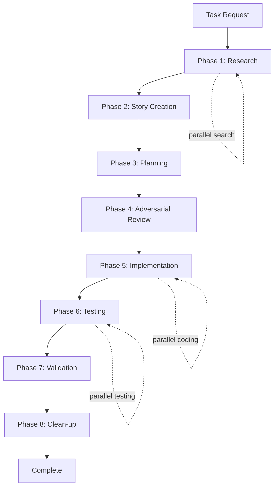

# Atlas Agent-Driven Workflow

## Overview

The Atlas workflow has evolved from manual script execution to an intelligent agent-orchestrated system. Each phase is now handled by specialized AI agents that work in parallel when possible, dramatically improving speed and quality.

## Agent Architecture

### Available Agent Types

| Agent | Type | Specialization | Phases |
|-------|------|----------------|--------|
| Researcher | `general-purpose` | Deep codebase exploration | Phase 1 |
| Product Manager | `product-manager` | Requirements & validation | Phases 2, 7 |
| Developer | `developer` | Technical planning & coding | Phases 3, 5 |
| Platform Expert | `ios-expert`, `android-expert` | Platform-specific implementation | Phases 3, 5 |
| Peer Reviewer | `peer-reviewer` | Quality & edge cases | Phases 4, 6 |
| QA Tester | `general-purpose` | Testing & verification | Phase 6 |
| Organizer | `general-purpose` | Clean-up & documentation | Phase 8 |

## Complete Workflow



## Phase-by-Phase Agent Usage

### Phase 1: Research (Researcher Agent)

**Trigger Command:**
```
Launch a general-purpose agent to research [TASK DESCRIPTION].
Find all related files, understand implementation, identify dependencies,
and document patterns. Search extensively and in parallel.
```

**Parallel Opportunities:**
- Multiple grep searches
- File pattern matching
- Documentation searches
- Test file discovery

### Phase 2: Story Creation (Product Manager Agent)

**Trigger Command:**
```
Launch a product-manager agent to create a story for [TASK DESCRIPTION].
Use research findings: [RESEARCH SUMMARY].
Create comprehensive acceptance criteria and success metrics.
```

**Key Outputs:**
- User story document
- Acceptance criteria
- Success metrics
- Requirements documentation

### Phase 3: Planning (Developer Agent)

**Trigger Command:**
```
Launch a developer agent to create implementation plan for [STORY ID].
Detail all file changes, technical approach, and implementation order.
```

**Platform-Specific Alternative:**
```
Launch an ios-expert/android-expert agent for platform-specific planning.
```

### Phase 4: Adversarial Review (Peer Reviewer Agent)

**Trigger Command:**
```
Launch a peer-reviewer agent to adversarially review the plan for [STORY ID].
Find edge cases, potential failures, and missing requirements.
Be harsh but constructive.
```

**Review Focus:**
- Edge cases
- Security issues
- Performance implications
- Missing requirements

### Phase 5: Implementation (Developer Agent)

**Trigger Command:**
```
Launch a developer agent to implement [STORY ID] following the approved plan.
Make changes incrementally and test as you go.
```

**Parallel Execution:**
```
Launch multiple developer agents in parallel:
- Agent 1: Frontend changes
- Agent 2: Backend changes
- Agent 3: Test updates
- Agent 4: Documentation updates
```

### Phase 6: Testing (QA Tester + Peer Reviewer)

**Trigger Command:**
```
Launch agents in parallel:
1. General-purpose agent for QA testing of [STORY ID]
2. Peer-reviewer agent for code quality review
```

**Test Coverage:**
- Functional testing
- Edge case validation
- Performance testing
- Cross-platform verification

### Phase 7: Validation (Product Manager Agent)

**Trigger Command:**
```
Launch product-manager agent to validate [STORY ID] implementation.
Verify all acceptance criteria are met and provide sign-off.
```

### Phase 8: Clean-up (Organizer Agent)

**Trigger Command:**
```
Launch general-purpose agent as organizer to clean up after [STORY ID].
Remove temp files, update documentation, close story, and organize evidence.
```

## Orchestration Patterns

### Sequential Execution
```
Agent 1 completes → Agent 2 starts → Agent 3 starts
```

### Parallel Execution
```
Launch multiple agents simultaneously:
- Researcher agents for different search patterns
- Developer agents for independent components
- Test agents for different platforms
```

### Hand-off Pattern
```
Researcher → Product Manager → Developer → Peer Reviewer
     ↓            ↓              ↓            ↓
  findings      story          code        review
```

## Example: Complete Feature Implementation

```markdown
User: "I need to add a dark mode toggle to settings"

You: I'll orchestrate the Atlas agent workflow for this feature.

## Phase 1: Research
*Launch general-purpose agent for research*
"Research dark mode requirements: find theme files, settings implementation,
and UI components that need theme support."

## Phase 2: Story Creation
*Launch product-manager agent*
"Create story for dark mode toggle using research findings. Include acceptance
criteria for theme switching, persistence, and UI updates."

## Phase 3: Planning
*Launch developer agent*
"Create implementation plan for ATLAS-XXX dark mode story. Detail theme
service, settings UI, and component updates."

## Phase 4: Adversarial Review
*Launch peer-reviewer agent*
"Review dark mode plan for edge cases: system theme conflicts, persistence
issues, component visibility, accessibility."

## Phase 5: Implementation
*Launch multiple developer agents in parallel*
- Agent 1: "Implement theme service and state management"
- Agent 2: "Update UI components for theme support"
- Agent 3: "Add settings toggle and persistence"

## Phase 6: Testing
*Launch parallel testing agents*
- QA Agent: "Test dark mode across all screens and features"
- Reviewer: "Review code quality and patterns"

## Phase 7: Validation
*Launch product-manager agent*
"Validate dark mode implementation meets all acceptance criteria"

## Phase 8: Clean-up
*Launch organizer agent*
"Clean up dark mode implementation artifacts and update documentation"
```

## Agent Coordination Rules

### 1. Parallel Execution Guidelines
- Use parallel agents when tasks are independent
- Batch similar operations together
- Coordinate results before proceeding

### 2. Hand-off Requirements
- Each agent provides clear outputs
- Next agent receives complete context
- No information lost between phases

### 3. Checkpoint Management
- User confirms after each phase
- Agents report completion status
- Clear progress visibility

### 4. Error Handling
- Agents report blockers immediately
- Fallback to sequential if parallel fails
- Maintain work artifacts for debugging

## Benefits Over Script-Based Workflow

| Aspect | Old (Scripts) | New (Agents) | Improvement |
|--------|--------------|--------------|-------------|
| Speed | Sequential only | Parallel execution | 3-5x faster |
| Quality | Manual review | Specialized agents | Higher consistency |
| Coverage | Human-dependent | Systematic | More thorough |
| Documentation | Often skipped | Automatic | Always complete |
| Clean-up | Manual | Organized agent | No debt accumulation |

## Best Practices

### DO ✅
- Launch agents in parallel when possible
- Provide clear, specific prompts
- Use specialized agents for their strengths
- Let agents complete their phase fully
- Save agent outputs for hand-offs

### DON'T ❌
- Skip phases to save time
- Merge agent responsibilities
- Ignore agent recommendations
- Override agent findings
- Proceed without checkpoints

## Migration from Script-Based Workflow

### Instead of:
```bash
python3 atlas/atlas_workflow.py feature "description"
```

### Use:
```
"I need to [TASK DESCRIPTION]. Please orchestrate the Atlas agent workflow,
launching appropriate agents for each phase. Execute in parallel where possible."
```

## Troubleshooting

### Agent Confusion
**Problem**: Agent unsure of task
**Solution**: Provide more specific context and examples

### Hand-off Failures
**Problem**: Information lost between agents
**Solution**: Explicitly pass outputs as inputs

### Parallel Conflicts
**Problem**: Agents modifying same files
**Solution**: Partition work clearly or run sequentially

### Quality Issues
**Problem**: Agent missing edge cases
**Solution**: Use peer-reviewer agent more aggressively

## Measuring Success

### Speed Metrics
- Research: 5-10 minutes (was 30+)
- Implementation: 20-30 minutes (was 2+ hours)
- Full workflow: Under 1 hour (was 4+ hours)

### Quality Metrics
- Defect escape rate: Near zero
- Test coverage: Comprehensive
- Documentation: Always complete
- Technical debt: None added

## Advanced Patterns

### Multi-Platform Development
```
Launch platform experts in parallel:
- ios-expert: "Implement iOS-specific features"
- android-expert: "Implement Android-specific features"
- developer: "Implement shared logic"
```

### Complex Refactoring
```
Phase 1: Multiple researchers for different subsystems
Phase 3: Architecture agent for design
Phase 5: Team of developers for parallel refactoring
```

### Emergency Fixes
```
Streamlined flow with parallel execution:
- Researcher + Peer Reviewer (find issue and risks)
- Developer + QA Tester (fix and verify)
- Organizer (clean up and document)
```

## Conclusion

The agent-driven Atlas workflow represents a paradigm shift from manual, sequential processes to intelligent, parallel execution. By leveraging specialized agents for each phase and enabling parallel operations, we achieve faster delivery with higher quality and better documentation.

The key is not just using agents, but orchestrating them effectively - knowing when to parallelize, how to hand off context, and where human checkpoints add value. This approach scales from simple bug fixes to complex feature development, always maintaining the Atlas principles of quality and thoroughness.